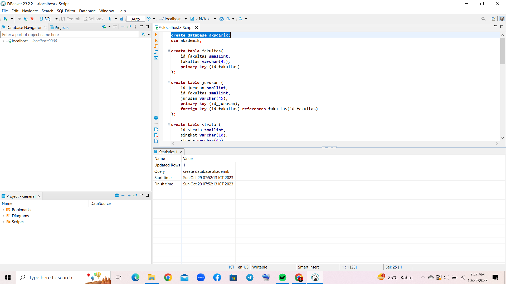
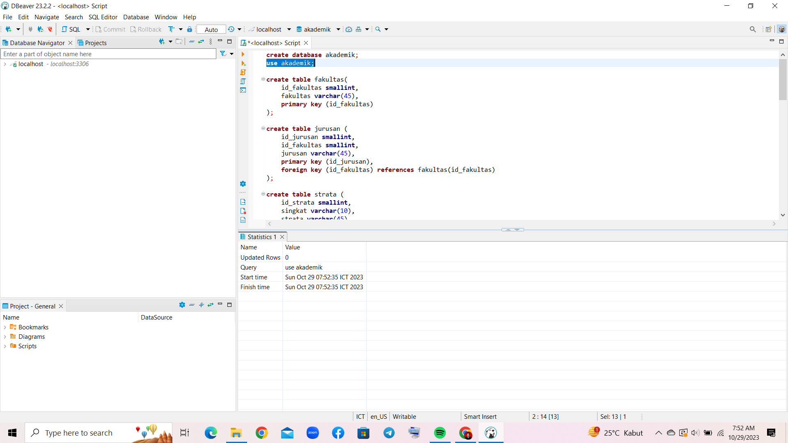
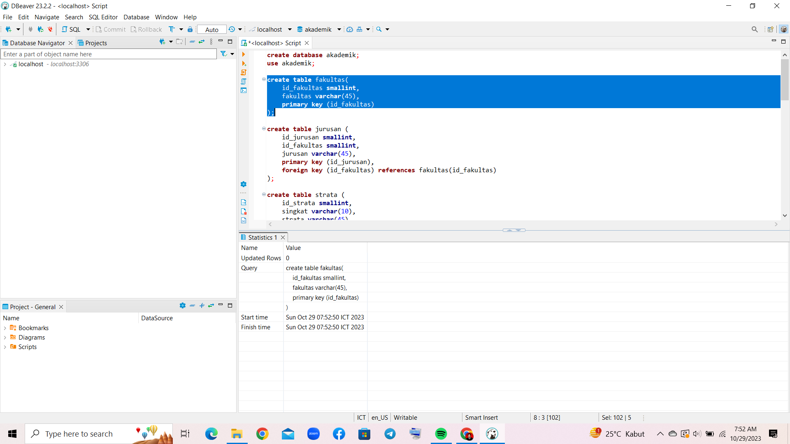
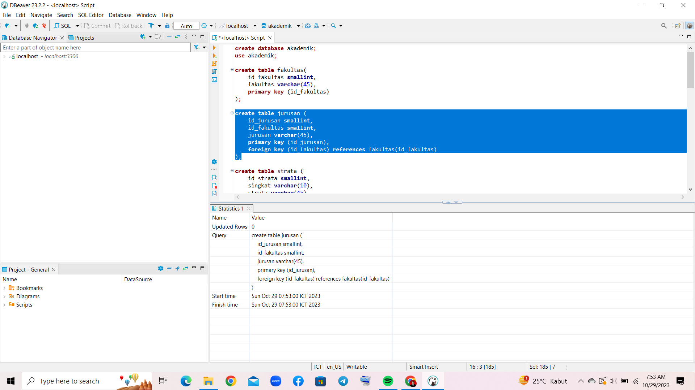
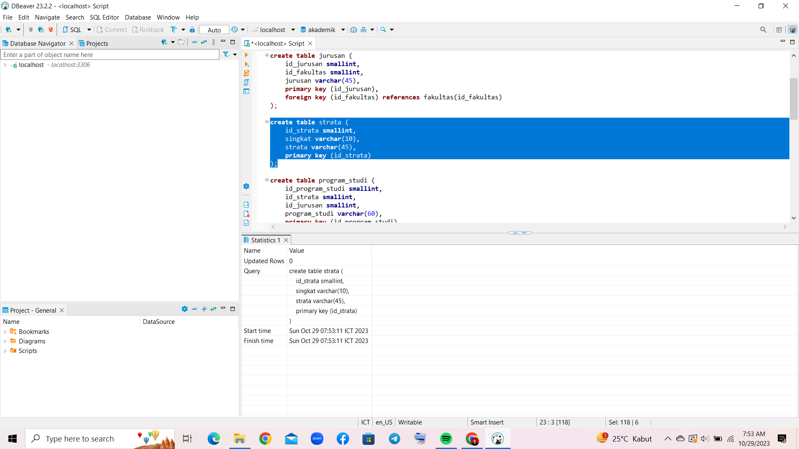
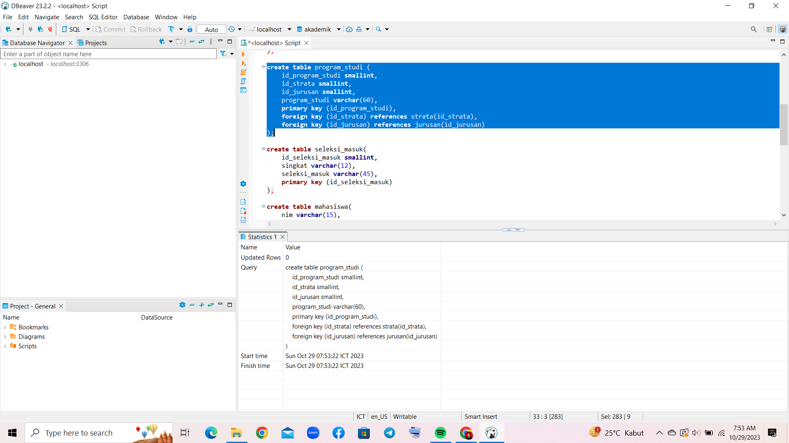
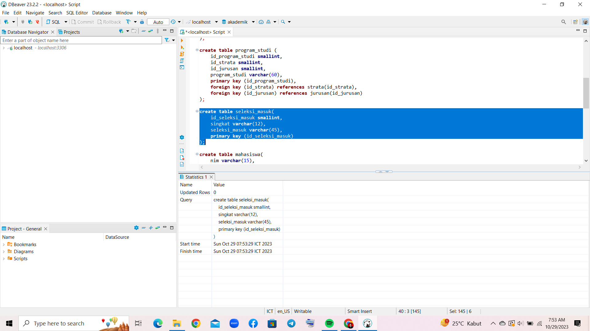
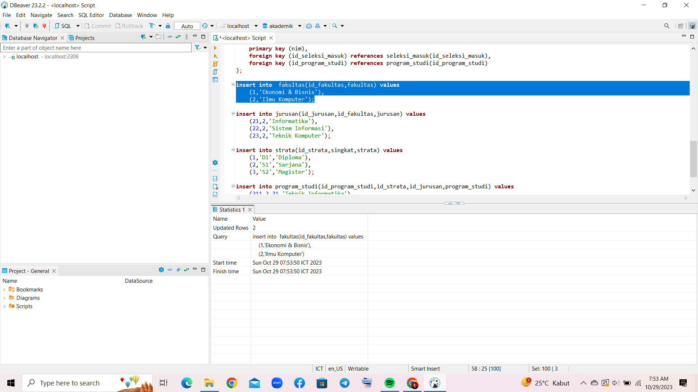
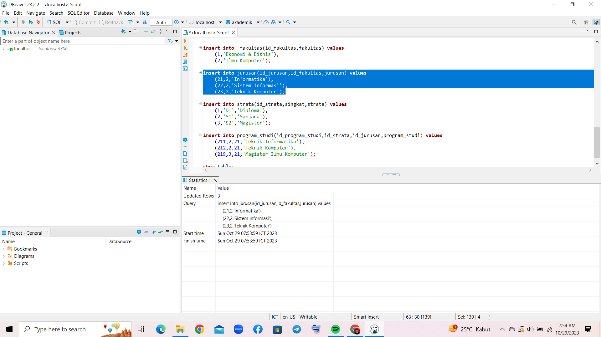
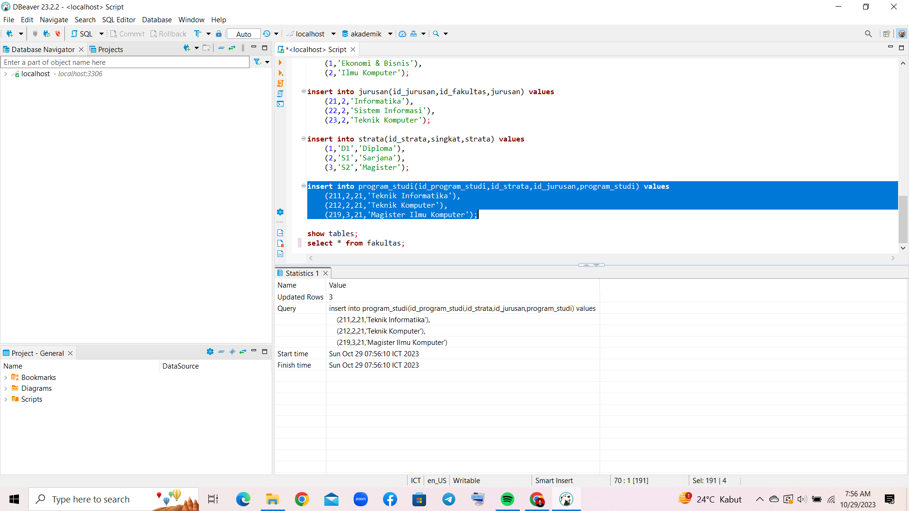

# Membuat Database dan Tabel di MySQL Menggunakan DBeaver

Dalam tutorial ini, kita akan membahas langkah-langkah untuk membuat sebuah database baru bernama 'akademik' dengan menggunakan DBeaver dan server MariaDB. Database 'akademik' akan terdiri dari beberapa tabel, yaitu fakultas, jurusan, strata, program_studi, seleksi_masuk, dan mahasiswa.

## Langkah 1: Membuka DBeaver dan Terhubung dengan Server MariaDB

Pertama, pastikan Anda telah membuka aplikasi DBeaver dan berhasil terhubung ke server MariaDB yang akan digunakan. Jika belum terhubung, tambahkan koneksi ke server MariaDB terlebih dahulu.

## Langkah 2: Membuat Database 'akademik'

```sql
create database akademik;
```


Pada langkah ini, kita akan membuat database baru dengan nama 'akademik' menggunakan perintah SQL di atas. Database ini akan menjadi tempat penyimpanan tabel-tabel yang akan kita buat selanjutnya.

## Langkah 3: Menggunakan Database 'akademik'

Setelah database 'akademik' dibuat, kita perlu beralih ke database ini agar perintah SQL selanjutnya dapat dijalankan di dalamnya. Gunakan perintah SQL berikut:

```sql
use akademik;
```


Perintah ini akan mengubah konteks penggunaan database ke 'akademik'.

## Langkah 4: Membuat Tabel 'fakultas'

Selanjutnya, kita akan membuat tabel 'fakultas' dengan perintah SQL di bawah ini:

```sql
create table fakultas(
    id_fakultas smallint,
    fakultas varchar(45),
    primary key (id_fakultas)
);
```



Tabel 'fakultas' memiliki dua kolom: `id_fakultas` dengan tipe data `smallint` dan `fakultas` dengan tipe data `varchar(45)`. Selain itu, `id_fakultas` dijadikan sebagai primary key, yang merupakan kolom unik yang akan mengidentifikasi setiap entri dalam tabel.

## Langkah 5: Membuat Tabel 'jurusan'

Selanjutnya, kita akan membuat tabel 'jurusan' dengan perintah SQL di bawah ini:

```sql
create table jurusan (
    id_jurusan smallint,
    id_fakultas smallint,
    jurusan varchar(45),
    primary key (id_jurusan),
    foreign key (id_fakultas) references fakultas(id_fakultas)
);
```

Tabel 'jurusan' memiliki tiga kolom: `id_jurusan`, `id_fakultas`, dan `jurusan`. `id_jurusan` dan `id_fakultas` adalah tipe data `smallint`, sedangkan `jurusan` adalah tipe data `varchar(45)`. `id_jurusan` dijadikan sebagai primary key, dan `id_fakultas` adalah foreign key yang merujuk ke kolom `id_fakultas` pada tabel 'fakultas'.

## Langkah 6: Membuat Tabel 'strata'

Selanjutnya, kita akan membuat tabel 'strata' dengan perintah SQL berikut:

```sql
create table strata (
    id_strata smallint,
    singkat varchar(10),
    strata varchar(45),
    primary key (id_strata)
);
```

Tabel 'strata' memiliki tiga kolom: `id_strata`, `singkat`, dan `strata`. `id_strata` adalah tipe data `smallint`, sedangkan `singkat` dan `strata` adalah tipe data `varchar(10)` dan `varchar(45)` berturut-turut. `id_strata` dijadikan sebagai primary key.

## Langkah 7: Membuat Tabel 'program_studi'

Berikut adalah perintah SQL untuk membuat tabel 'program_studi':

```sql
create table program_studi (
    id_program_studi smallint,
    id_strata smallint,
    id_jurusan smallint,
    program_studi varchar(60),
    primary key (id_program_studi),
    foreign key (id_strata) references strata(id_strata),
    foreign key (id_jurusan) references jurusan(id_jurusan)
);
```

Tabel 'program_studi' memiliki empat kolom: `id_program_studi`, `id_strata`, `id_jurusan`, dan `program_studi`. Kolom `id_program_studi` adalah tipe data `smallint`, sedangkan `id_strata` dan `id_jurusan` adalah tipe data `smallint`, dan `program_studi` adalah tipe data `varchar(60)`. `id_program_studi` dijadikan sebagai primary key, dan terdapat dua foreign key yang merujuk ke kolom `id_strata` pada tabel 'strata' dan `id_jurusan` pada tabel 'jurusan'.

## Langkah 8: Membuat Tabel 'seleksi_masuk'

Selanjutnya, mari buat tabel 'seleksi_masuk' dengan perintah SQL berikut:

```sql
create table seleksi_masuk(
    id_seleksi_masuk smallint,
    singkat varchar(12),
    seleksi_masuk varchar(45),
    primary key (id_seleksi_masuk)
);
```

Tabel 'seleksi_masuk' memiliki tiga kolom: `id_seleksi_masuk`, `singkat`, dan `seleksi_masuk`. `id_seleksi_masuk` adalah tipe data `smallint`, `singkat` adalah tipe data `varchar(12)`, dan `seleksi_masuk` adalah tipe data `varchar(45)`. `id_seleksi_masuk` dijadikan sebagai primary key.

## Langkah 9: Membuat Tabel 'mahasiswa'

Selanjutnya, kita akan membuat tabel 'mahasiswa' dengan perintah SQL berikut:

```sql
create table mahasiswa(
    nim varchar(15),
    id_seleksi_masuk smallint,
    id_program_studi smallint,
    nama varchar(45),
    angkatan smallint,
    tgl_lahir date,
    kota_lahir varchar(60),
    jenis_kelamin char(1),
    primary key (nim),
    foreign key (id_seleksi_masuk) references seleksi_masuk(id_seleksi_masuk),
    foreign key (id_program_studi) references program_studi(id_program_studi)
);
```

Tabel 'mahasiswa' memiliki delapan kolom: `nim`, `id_seleksi_masuk`, `id_program_studi`, `nama`, `angkatan`, `tgl_lahir`, `kota_lahir`, dan `jenis_kelamin

`. Kolom `nim` adalah tipe data `varchar(15)`, `id_seleksi_masuk` dan `id_program_studi` adalah tipe data `smallint`, `nama` adalah tipe data `varchar(45)`, `angkatan` adalah tipe data `smallint`, `tgl_lahir` adalah tipe data `date`, `kota_lahir` adalah tipe data `varchar(60)`, dan `jenis_kelamin` adalah tipe data `char(1)`. `nim` dijadikan sebagai primary key, dan terdapat dua foreign key yang merujuk ke kolom `id_seleksi_masuk` pada tabel 'seleksi_masuk' dan `id_program_studi` pada tabel 'program_studi'.

## Langkah 10: Memasukkan Data ke Tabel

Setelah tabel-tabel terbentuk, kita dapat menggunakan perintah `insert` untuk memasukkan data ke dalam tabel-tabel tersebut sesuai dengan contoh yang diberikan dalam kode.

```sql
-- Contoh pengisian data fakultas
insert into  fakultas(id_fakultas,fakultas) values 
	(1,'Ekonomi & Bisnis'),
	(2,'Ilmu Komputer');
```


```sql
-- Contoh pengisian data jurusan
insert into jurusan(id_jurusan,id_fakultas,jurusan) values
	(21,2,'Informatika'),
	(22,2,'Sistem Informasi'),
	(23,2,'Teknik Komputer');
```


```sql
-- Contoh pengisian data strata
insert into strata(id_strata,singkat,strata) values
	(1,'D1','Diploma'),
	(2,'S1','Sarjana'),
	(3,'S2','Magister');
```


```sql
-- Contoh pengisian data program_studi
insert into program_studi(id_program_studi,id_strata,id_jurusan,program_studi) values
	(211,2,21,'Teknik Informatika'),
	(212,2,21,'Teknik Komputer'),
	(219,3,21,'Magister Ilmu Komputer');
```


```sql
-- Contoh pengisian data seleksi_masuk
insert into seleksi_masuk(id_seleksi_masuk,singkat,seleksi_masuk) values
	(1,'SNMPTN','SELEKSI NASIONAL MAHASISWA PTN'),
	(2, 'SBMPTN', 'SELEKSI BERSAMA MAHASISWA PTN');
```


```sql
-- Contoh pengisian data mahasiswa
insert into mahasiswa(nim,id_seleksi_masuk,id_program_studi,nama,angkatan,tgl_lahir,kota_lahir,jenis_kelamin) values
	('155150400',1,211,'JONI',2015,'1997-1-1','Malang','W'),
	('155150401',2,212,'JONO',2015,'1997-10-2','Situbondo','P');
```


Untuk memastikan apakah data yang kita inputkan sudah berhasil masuk ke dalam tabel dapat kita lakukan ccek dengan memasukkan kode berikut,
```sql
select * from [namaTabel];
```

Dalam gambar diatas dapat kita lihat bahwa data Mahasiswa sudah berhasil di inputkan padda tabel 'Mahasiswa'

## Menggunakan dan Memodifikasi Data

Selain itu, kita juga dapat menggunakan perintah SQL untuk mengakses, memodifikasi, dan mengelola data di dalam tabel. Contoh penggunaannya seperti di bawah ini:

```sql
-- Mengubah nama mahasiswa dengan nama 'JONO' menjadi 'KIYYA'
update mahasiswa set nama = 'KIYYA' where nama = 'JONO';

-- Mengubah nama mahasiswa dengan nama 'JONI' menjadi 'WARDANI'
update mahasiswa set nama = 'WARDANI' where nama ='JONI';
```
Setelah menginputkan syntax untuk melihat isi data mmaka akan terlihat bahwa nama mahasiswa berubah seperti yang sudah tertera pada gambar berikut:


Dengan mengikuti langkah-langkah di atas, Anda telah berhasil membuat database 'akademik' dan tabel-tabel yang sesuai dengan struktur yang diinginkan. Anda juga dapat memasukkan dan mengelola data di dalam tabel-tabel tersebut menggunakan perintah SQL.
